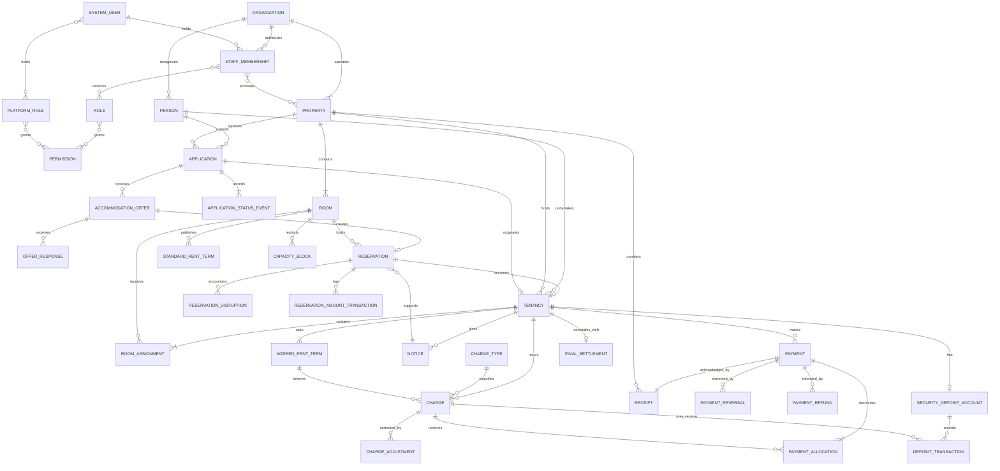

# PG Management Software Domain Model Handoff

This document is the source handoff from the stateless conceptual-modeling session. It records the confirmed domain model and constraints before implementation or database schema design.

## Purpose

Admin-side PG management application covering:

`Application -> Offer -> Reservation -> Check-in -> Tenancy -> Rent and payments -> Notice -> Move-out -> Settlement`

The conceptual model must be settled before designing tables, columns, keys, indexes, migrations, or persistence details.

## Scope

Included:

- Organizations, properties, rooms, capacity, and operational capacity blocks
- People, one current emergency contact, and identity-document replacement history
- Applications, status history, sharing-capacity preferences, offers, and responses
- Reservations and reservation amounts
- Tenancies, room assignments, agreed rent terms, notices, and move-out
- Rent and configurable non-rent charges
- Payments, allocations, receipts, reversals, refunds, and charge adjustments
- Security deposits and final settlement
- Calculated vacancies
- Significant business-change auditing

Excluded from the initial model:

- Visitors, complaints, maintenance as a business module, meals, attendance, payroll, and inventory
- Generic placeholders for future modules
- Property ownership transfers between organizations
- Tenant-facing portal or in-app applicant responses

## Glossary

### Organization

An independent PG business. It owns properties and organization-scoped people and operational records. Separate organizations cannot discover one another's applicants or tenants.

### Property

A PG accommodation property operated by one organization. It contains rooms, defines operational and billing policies, and maintains its own receipt-number sequence.

### Room

A stable accommodation object belonging to one property. It has current capacity and effective-dated standard-rent terms. Retiring a room preserves its history; a later room with the same number is a new room.

### Bed / capacity place

An operational allocation position rather than a historical domain entity. Individual bed history is not retained. Historical records retain the room only.

### Person

An organization-scoped individual who may submit applications and have multiple tenancies. The same real-world person may have separate records at unrelated organizations.

### Identity document

One current document for a person, either Aadhaar or passport. A replaced document remains historical. Verification applies to each document.

### Emergency contact

One current emergency contact for a person. Replacement overwrites the prior value; history is not required.

### Application

One request by a Person to stay at one Property. A person may submit multiple applications. Each application retains its own status history and outcome.

### Sharing-capacity preference

The applicant's desired occupancy level, such as private, two-sharing, or three-sharing. It does not identify a room or bed.

### Accommodation offer

The room, sharing arrangement, and rent offered by an administrator. The applicant response is recorded by the administrator because the current product is admin-side only.

### Reservation

A time-bounded claim on one capacity place in a specific room before check-in. It consumes capacity while valid. A reservation depending on expected availability is marked at risk.

### Reservation amount

A small amount paid to hold an offered accommodation. It is distinct from the security deposit. On successful check-in it is refunded or credited toward the security deposit according to property policy or a documented administrator override. If the applicant does not check in, it is retained according to policy.

### Tenancy

One continuous stay by a Person at a Property. A new application and check-in create a new tenancy. Room transfers do not end the tenancy.

### Room assignment

An effective-dated record of the room occupied by a tenancy. A tenancy may have multiple sequential assignments, with one active assignment at a time.

### Rent term

An effective-dated agreed rent amount for a tenancy. It may change independently of room transfers. Agreed rent is authoritative over standard room rent.

### Notice

A tenant's intention to leave. It may be revised or cancelled. Expected move-out is calculated from the tenancy-specific notice period, then the property default, with documented administrator overrides allowed.

### Capacity block

A temporary operational restriction removing one or more places or the entire room from availability. It does not change configured capacity.

### Charge

An amount owed by a tenant. Types are configurable and may include rent, damage, utilities, food, late fees, and overstay penalties. Rent charges additionally identify their billing period and rent terms.

### Payment

Money received from a tenant. A payment may be allocated across multiple charges, and a charge may receive multiple payments.

### Receipt

Evidence of one payment transaction. One payment produces one receipt, regardless of allocation. Receipt numbers are property-specific and never reused.

### Security deposit

The single deposit account belonging to a tenancy. It records collections, additions, deductions, applications, refunds, and balance.

### Final settlement

Explicit resolution of a tenancy's financial position after move-out. Deposit applications and deductions are never implicit.

### Vacancy

Calculated current availability, not an independently edited record.

## Confirmed Rules

- A Person may have multiple Applications and multiple Tenancies over time.
- Applications are organization-scoped; unrelated organizations are isolated.
- Approval does not create a reservation. Reservation does not create a tenancy. Check-in creates a tenancy.
- An administrator may create a tenancy directly for a walk-in admission, existing offline tenant, or data migration. This requires a reason, note, administrator, and timestamp.
- A directly created tenancy still requires a Person, Property, initial Room Assignment, joining date, Rent Term, and security-deposit terms.
- The admin records offer acceptance or decline and the response date. Only an accepted offer can create a reservation.
- An applicant receives a room based on availability; only sharing-capacity preference is stored.
- A reservation claims one place in a specific room.
- Room capacity cannot be reduced below active occupancy, valid reservations, and applicable blocks.
- A future reservation may depend on a notice but is at risk until the place is vacated and operationally ready.
- The system never silently cancels, relocates, or evicts anyone to resolve a capacity conflict.
- Room transfers continue the same tenancy and use independently effective-dated room assignments and rent terms.
- A property defines billing cycle, proration, notice period, cancellation policy, overstay policy, reservation-amount handling, charge priority, and related policies.
- A tenancy may override property policy when the agreement and reason are recorded.
- Charges are automatically generated as drafts, reviewed, adjusted, and finalized.
- Finalized charges are immutable; corrections use linked credit or debit adjustments.
- Payments are allocated by property-configured charge priority. Manual overrides require a reason.
- Original payments and receipts are immutable; corrections use reversals, refunds, or adjustments.
- A reservation amount is distinct from the security deposit and rent payments.
- Actual move-out ends occupancy and releases capacity, but readiness blocks may delay new allocation.
- Financial settlement may continue after move-out. A tenancy closes only when every charge and deposit balance is explicitly resolved.
- “Remove tenant” means close/archive the tenancy, not delete historical records.
- Overlapping active tenancies are permitted after an explicit administrator confirmation warning.
- Organization roles include standard roles such as Organization Owner, Property Manager, and Accountant, with controlled customization.
- Platform Tech Team has unrestricted cross-organization access. Changes are audited; views are not audited.
- Significant business changes retain actor, timestamp, prior value, new value, and reason where relevant.

## Conceptual Relationships

- Organization operates Properties and authorizes staff memberships.
- Property contains Rooms and receives Applications.
- Person submits Applications and undertakes Tenancies.
- Application records status events and receives Offers.
- An accepted Offer may create one Reservation.
- A Reservation may become one Tenancy after check-in.
- A Tenancy originates from zero or one Application. The normal path has one accepted Application; an audited direct creation has none.
- A Tenancy contains Room Assignments, Agreed Rent Terms, Notices, Charges, Payments, and one optional Security Deposit Account.
- Room receives Reservations and Room Assignments, publishes Standard Rent Terms, and has Capacity Blocks.
- Payments distribute through Payment Allocations to Charges and are acknowledged by one Receipt.
- A Charge may receive linked adjustments and explicit deposit applications.
- A Tenancy may conclude with one Final Settlement.
- Vacancy is derived from current room capacity, active assignments, valid reservations, and capacity blocks.

## ER Diagram Draft

## Next Step

The repository-backed continuation should invoke `grill-with-docs` and create `CONTEXT.md` plus ADRs only where decisions are hard to reverse, surprising without context, and based on a real trade-off. Then perform a final domain review before `to-spec` or implementation.
